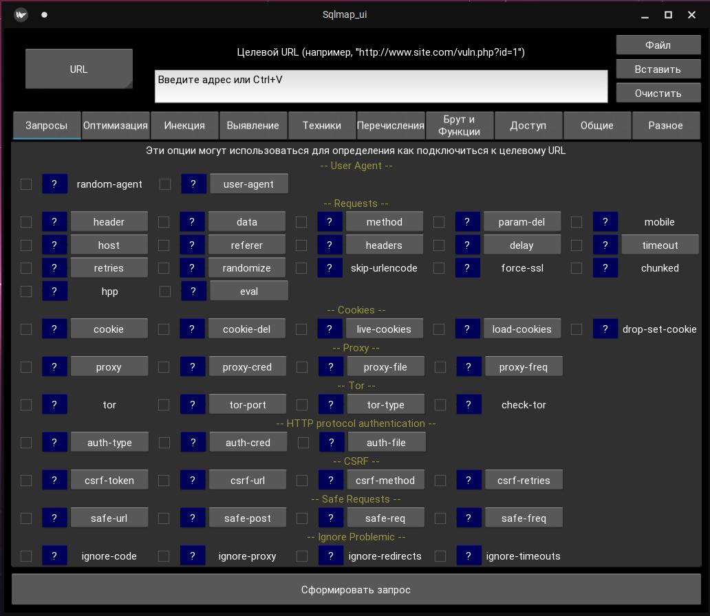
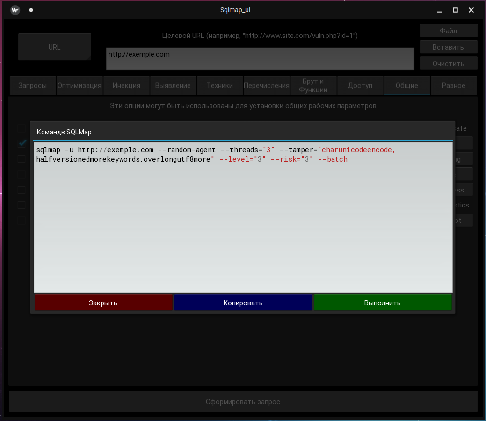
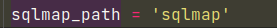

# SQLMap User Interface
___
Интерфейс для SQLMap.


Программа не содержит файлы [SQLMap](https://github.com/sqlmapproject/sqlmap).

___



___
### Зависимости:
```commandline
Python 3.8.10 
Kivy 2.0.0
loguru 0.6.0
```

Разрабатывалось на Kivy 2.0, но должно работать и на Kivy 1.11
___
### Установка:

Установка Kivy:
https://kivy.org/doc/stable/gettingstarted/installation.html

Установака loguru:
```pip install loguru```

___
### Запуск:
```
python -m pip install -r requirements.txt
python3 Main.py
```

### Для запуска SqlMap из программы: 
Если ваша команда запуска sqlmap отличается от 
```root@root:~$ sqlmap```
необходимо отредактировать команду запуска в файле command_dict.py



___
Источники:

https://github.com/sqlmapproject/sqlmap/wiki/Usage

https://kali.tools/?p=816
___
Спасибо!

 BTC - 
1MYQ3b6W7f5tFbr8aJYr3DmXKB5s34dfFU

 ETH - 
0x964Be9848BC535175D1134223F1e6853c846943B


